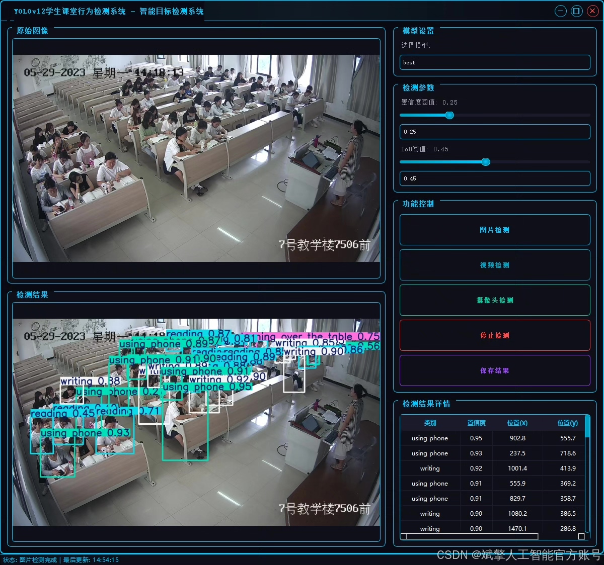
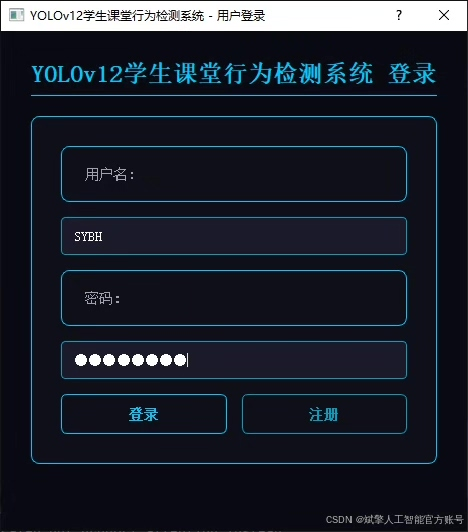
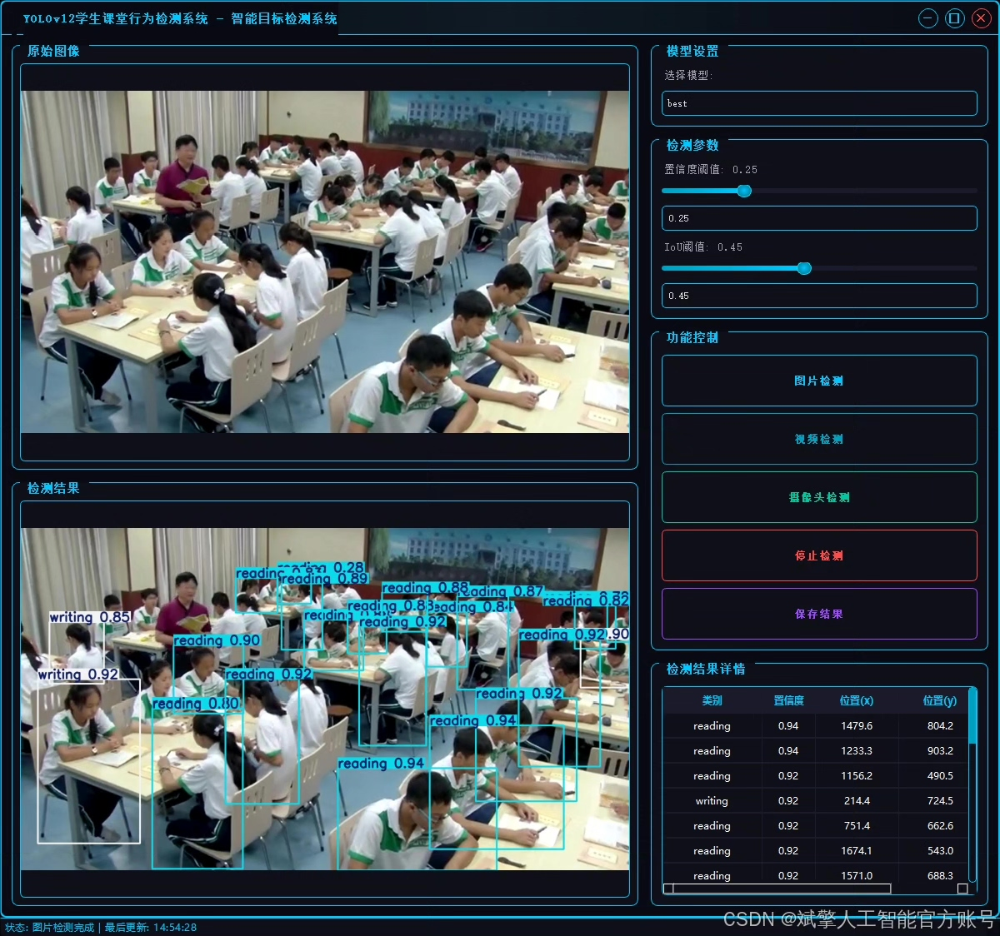
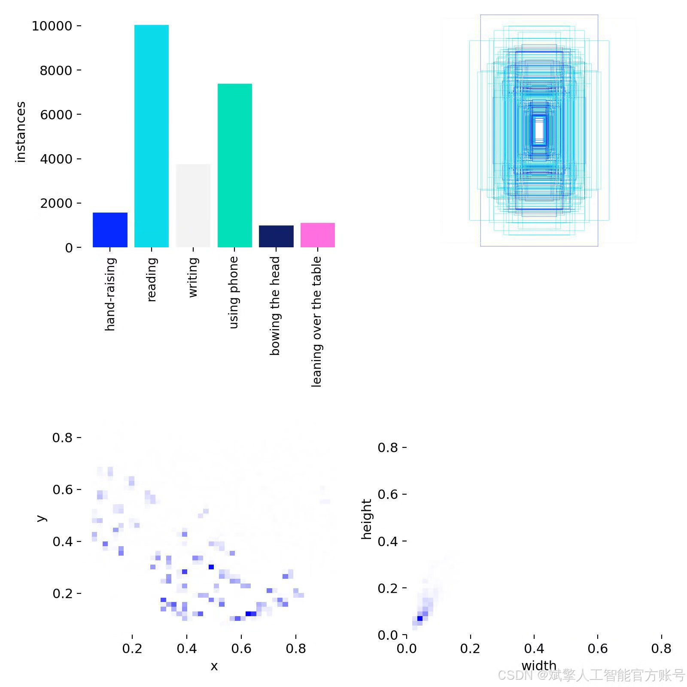
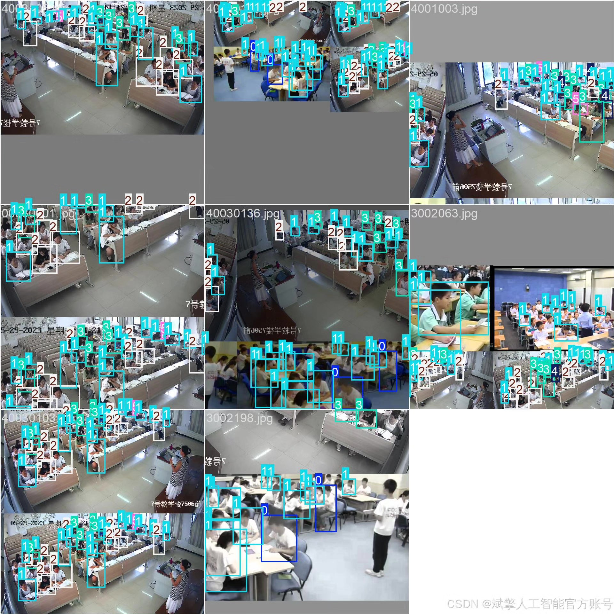
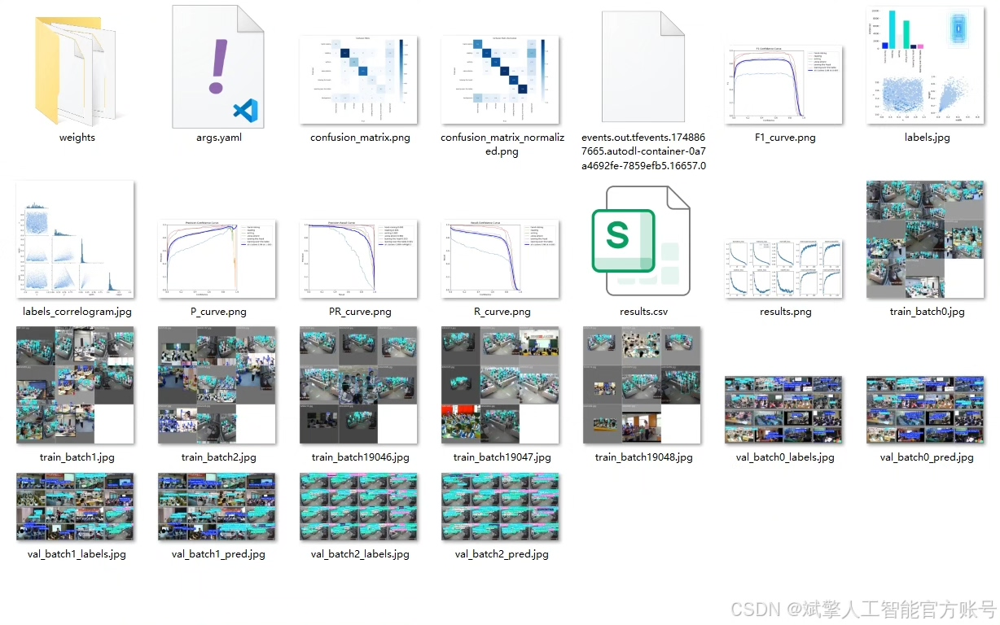
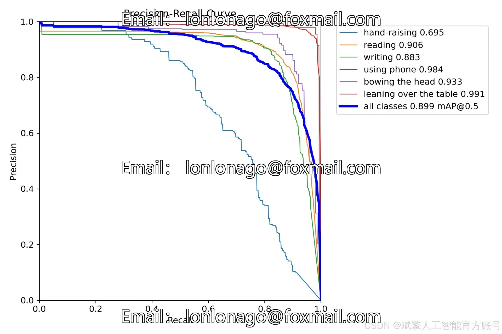
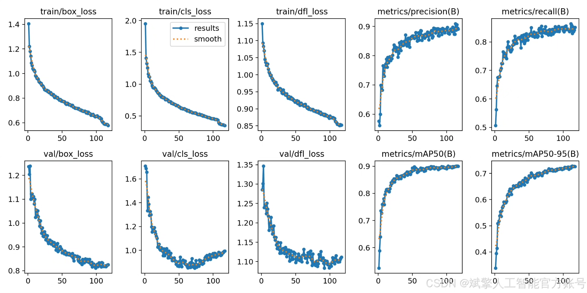
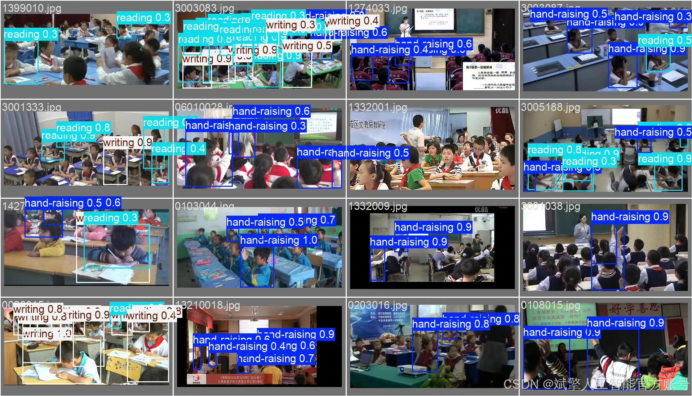

# YOLOv12 Classroom Behavior Identification System

## Body

The YOLOv12-based classroom behavior recognition system is designed and implemented to detect students' behaviors in the classroom in real time, aiming to enhance teaching management and classroom interaction efficiency. The system supports six types of behavior detection, including raising hands (hand-raising), reading (reading), writing (writing), using a phone (using phone), bowing the head (bowing the head), and leaning over the table (leaning over the table). The dataset includes 1,422 training images, 203 validation images, and 407 test images, which have been labeled and enhanced to optimize the model's generalization ability.
✅ User login registration: Supports password detection and security verification.
✅ Three detection modes: Based on the YOLOv12 model, supporting image, video, and real-time camera detection, with precise target recognition.
✅ Dual-screen comparison: Displays the original scene and detection results on the same screen.
✅ Data visualization: Real-time table display of the detected target categories, confidence levels, and coordinates.
✅ Intelligent parameter adjustment: Offers a confidence slide bar for dynamically optimizing detection accuracy, adapting to different scene requirements.
✅ Sci-fi style interface: Dark theme combined with dynamic light effects, reducing visual fatigue and enhancing the operation experience.

## Images

## Payment

Here is a pay link on Stripe ( https://buy.stripe.com/3cs8yP7sY87d0vu9AB ). Please contact me lonlonago@foxmail.com after funding $89, and I will send you a complete data files , thank you!

